[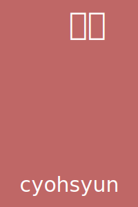](https://irocore.com/cyohsyun/)[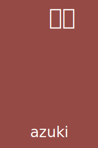](https://irocore.com/azuki/)[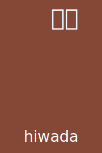](https://irocore.com/hiwada/)[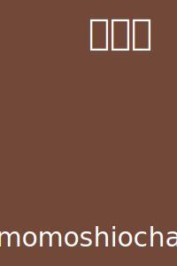](https://irocore.com/momoshiocha/)[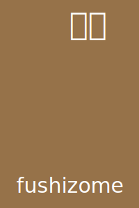](https://irocore.com/fushizome/)[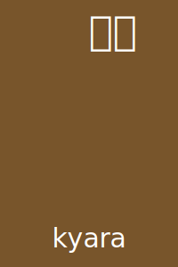](https://irocore.com/kyara/)[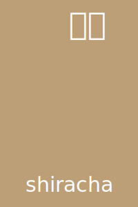](https://irocore.com/shiracha/)[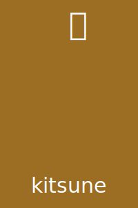](https://irocore.com/kitsune/)[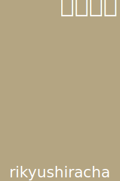](https://irocore.com/rikyushiracha/)[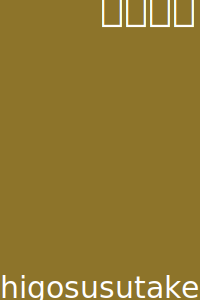](https://irocore.com/higosusutake/)[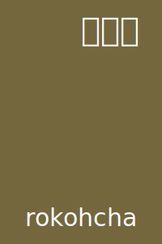](https://irocore.com/rokohcha/)[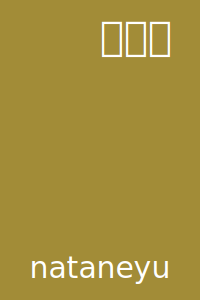](https://irocore.com/nataneyu/)[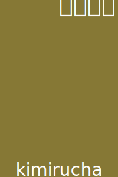](https://irocore.com/kimirucha/)[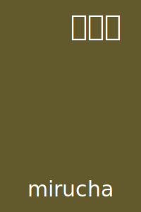](https://irocore.com/mirucha/)[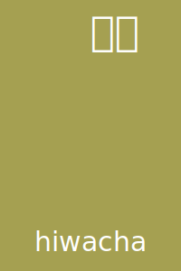](https://irocore.com/hiwacha/)[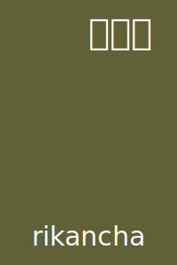](https://irocore.com/rikancha/)[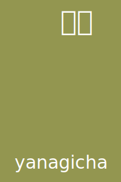](https://irocore.com/yanagicha/)[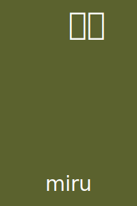](https://irocore.com/miru/)[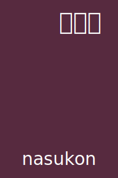](https://irocore.com/nasukon/)[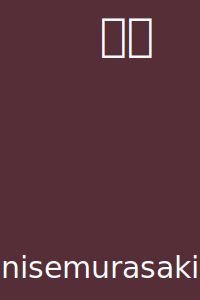](https://irocore.com/nisemurasaki/)[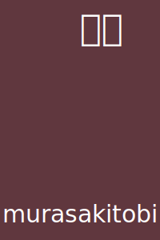](https://irocore.com/murasakitobi/)[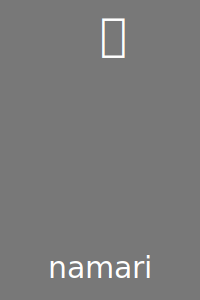](https://irocore.com/namari/)[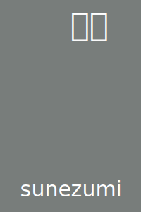](https://irocore.com/sunezumi/)[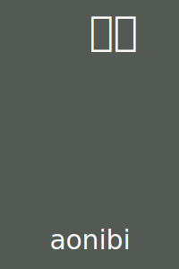](https://irocore.com/aonibi/)[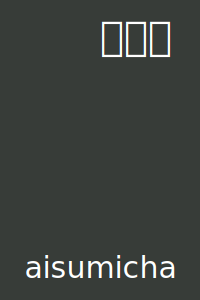](https://irocore.com/aisumicha/)[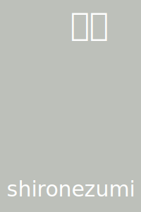](https://irocore.com/shironezumi/)[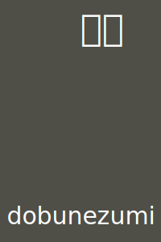](https://irocore.com/dobunezumi/)[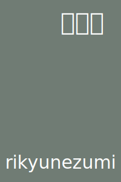](https://irocore.com/rikyunezumi/)[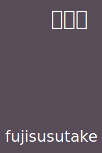](https://irocore.com/fujisusutake/)[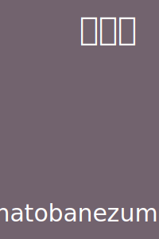](https://irocore.com/hatobanezumi/)[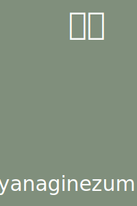](https://irocore.com/yanaginezumi/)[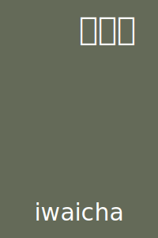](https://irocore.com/iwaicha/)[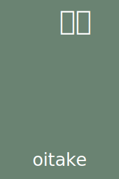](https://irocore.com/oitake/)[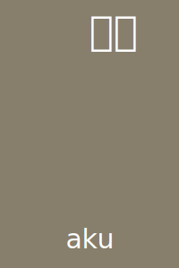](https://irocore.com/aku/)[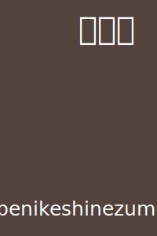](https://irocore.com/benikeshinezumi/)[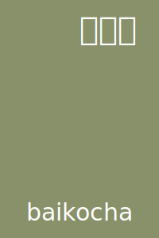](https://irocore.com/baikocha/)[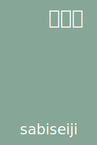](https://irocore.com/sabiseiji/)[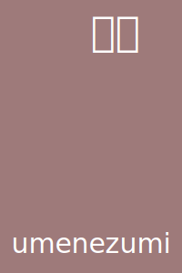](https://irocore.com/umenezumi/)[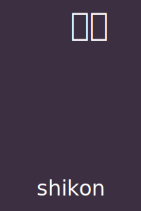](https://irocore.com/shikon/)[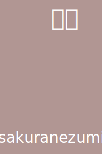](https://irocore.com/sakuranezumi/)[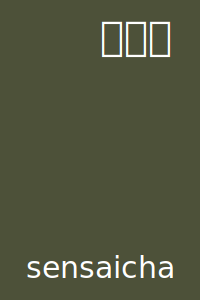](https://irocore.com/sensaicha/)[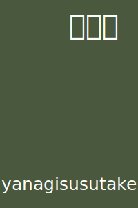](https://irocore.com/yanagisusutake/)[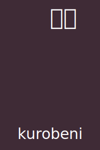](https://irocore.com/kurobeni/)[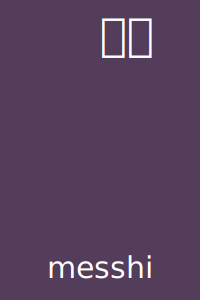](https://irocore.com/messhi/)[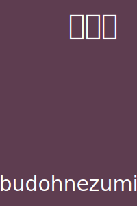](https://irocore.com/budohnezumi/)[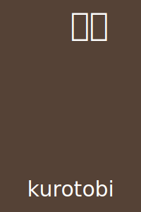](https://irocore.com/kurotobi/)[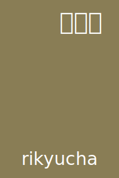](https://irocore.com/rikyucha/)[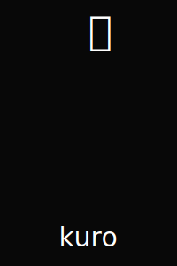](https://irocore.com/kuro/)[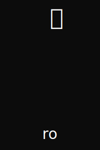](https://irocore.com/ro/)[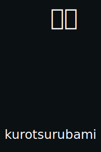](https://irocore.com/kurotsurubami/)